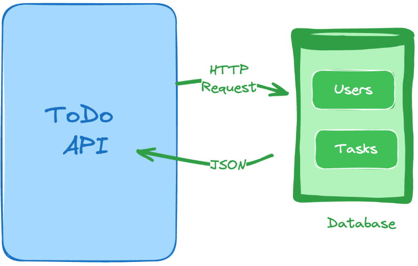

# Todo-List-API

## Project Description

Build a RESTful API to allow users to manage their to-do list.

The requirements implemented are described here: https://roadmap.sh/projects/todo-list-api

The API is built using Javascript, Node and Express.

It has 6 endpoints:
- POST /register - to register a new user
- POST /login - to login an existing user
- POST /todos - to add a task to the to do list
- PUT /todos/:id - to update a task in the to do list
- DELETE /todos/:id - to delete a task from the to do list
- GET /todos - to list all the tasks in the to do list

The API features:
-  Authentication of users using Passport.js and JWTs (JSON web tokens)
-  A local PostgreSQL database with 2 tables to store users and tasks. bcrypt was used to encrypt passwords before inserting into the database table.
-  Error handling and input data validation

I used Postman to manually test all 6 endpoints, including input data validation. I also used Git to iteratively commit discrete changes to GitHub.

## Tools/Frameworks used

Javascript, Node, Express, PostgreSQL, bcrypt, Passport.js, Postman, JWTs (JSON web tokens), Git

## Components

### REST API design
Diagram from: https://roadmap.sh/projects/todo-list-api

### Database schema

The PostgreSQL database had 2 tables: users and tasks. Below are their schema:

**"users" table:**

| Column | Type |
| ----------- | ----------- |
| id | INTEGER PRIMARY KEY GENERATED ALWAYS AS IDENTITY |
| name | VARCHAR ( 255 ) |
| email | VARCHAR ( 255 ) |
| password | VARCHAR ( 255 ) |

**"tasks" table:**
| Column | Type |
| ----------- | ----------- |
| id | INTEGER PRIMARY KEY GENERATED ALWAYS AS IDENTITY |
| title | VARCHAR ( 255 ) |
| description | VARCHAR ( 255 ) |
| user_id | INTEGER REFERENCES users(id) |

## Next Steps
- Understand why RESTful API and not the other types
- GET /todos should return only those items created by the user (and not all todos)
- Apply page and limit for the todos returned
- Revise the message for an unauthorized user from the default Passport.js error “Unauthorized” to json {  "message": "Unauthorized" } (per the requirements)
- Make it user friendly - create a UI with buttons and input boxes for each of the endpoints (need inputs for Authorization header and Body) (include video of it working) (currently, need to start database and server and use Postman)
- Add unit tests (errors with improper inputs, correct outputs). (Would have been easier to be confident each time I made changes rather than having to manually test each time.)
- Security item: enable CORS
- Additional data validation
  - During user registration, ensure emails are unique and that they’re in the proper format
  - During update and deletion of a task, make sure to validate the user has the permission to action the to-do item i.e. the user is the creator of todo item that they are updating/deleting. Respond with an error message {"message": "Forbidden"} and status code 403 and if the user is not authorized to update/delete the item.
  - During a task update, check if the task id is in the database
- Transition to a production database (rather than local database)
- Implement filtering and sorting for the to-do list
- Implement rate limiting and throttling for the API
- Implement refresh token mechanism for the authentication